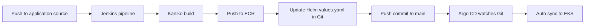

# Jenkins + Argo CD CI/CD Project

## Project Overview

This project implements a full CI/CD pipeline for a Django application on Amazon EKS with:

- Terraform for infrastructure provisioning
- Jenkins (installed by Helm via Terraform) for CI
- Amazon ECR for container images
- Argo CD (installed by Helm via Terraform) for GitOps-based CD
- Helm chart for Kubernetes application deployment

The pipeline flow is:

1. Jenkins builds Docker image with Kaniko.
2. Jenkins pushes image to ECR.
3. Jenkins updates image tag in Helm values.yaml in Git.
4. Argo CD detects Git change and syncs to EKS automatically.

## Project Structure

```text
Project/
├── main.tf
├── backend.tf
├── outputs.tf
│
├── modules/
│   ├── s3-backend/
│   │   ├── s3.tf
│   │   ├── dynamodb.tf
│   │   ├── variables.tf
│   │   └── outputs.tf
│   │
│   ├── vpc/
│   │   ├── vpc.tf
│   │   ├── routes.tf
│   │   ├── variables.tf
│   │   └── outputs.tf
│   │
│   ├── ecr/
│   │   ├── ecr.tf
│   │   ├── variables.tf
│   │   └── outputs.tf
│   │
│   ├── eks/
│   │   ├── eks.tf
│   │   ├── aws_ebs_csi_driver.tf
│   │   ├── variables.tf
│   │   └── outputs.tf
│   │
│   ├── jenkins/
│   │   ├── jenkins.tf
│   │   ├── variables.tf
│   │   ├── providers.tf
│   │   ├── values.yaml
│   │   └── outputs.tf
│   │
│   └── argo_cd/
│       ├── jenkins.tf
│       ├── variables.tf
│       ├── providers.tf
│       ├── values.yaml
│       ├── outputs.tf
│       └── charts/
│           ├── Chart.yaml
│           ├── values.yaml
│           └── templates/
│               ├── application.yaml
│               └── repository.yaml
│
├── charts/
│   └── django-app/
│       ├── templates/
│       │   ├── deployment.yaml
│       │   ├── service.yaml
│       │   ├── configmap.yaml
│       │   └── hpa.yaml
│       ├── Chart.yaml
│       └── values.yaml
└── README.md
```

## Components

### S3 Backend + DynamoDB

- S3 stores Terraform state.
- DynamoDB provides state locking.

### VPC

- VPC
- Public and private subnets
- Internet gateway and NAT gateway
- Route tables

### ECR

- Stores Docker images for the Django application.

### EKS

- EKS control plane and managed node group
- OIDC provider for IRSA
- EBS CSI driver addon for persistent volumes

### Jenkins

Installed via Helm from Terraform module modules/jenkins.

Includes:

- Persistent storage via EBS CSI-backed StorageClass
- IRSA role for Kubernetes agent pods
- Service account jenkins-sa for Kaniko/Git agents
- JCasC credentials and seed job creation

Default admin credentials:

- Username: admin
- Password: admin123

### Jenkinsfile CI

Jenkinsfile stages:

1. Clone app repository
2. Build and push image to ECR with Kaniko
3. Clone GitOps/infra repository
4. Update values.yaml image repository/tag
5. Commit and push to main

### Argo CD

Installed via Helm from Terraform module modules/argo_cd.

Includes:

- Argo CD release from official argo-helm repository
- Local argo-apps chart that creates:
  - Argo CD Application resource
  - Repository credentials Secret (for private repo access)
- Automated sync policy:
  - prune: true
  - selfHeal: true

Argo CD tracks repository and chart path configured in module argo_cd in main.tf.

## CI/CD Scheme



## Terraform Commands

```bash
terraform init
terraform plan
terraform apply
terraform destroy
```

## Deployment and Verification

### Configure kubectl

```bash
aws eks update-kubeconfig --region eu-north-1 --name lesson-7-eks
kubectl get nodes
```

### Verify Jenkins

```bash
kubectl get pods -n jenkins
kubectl get svc -n jenkins
kubectl get pvc -n jenkins
kubectl get sa -n jenkins
```

### Verify Argo CD

```bash
kubectl get pods -n argocd
kubectl get svc -n argocd
kubectl get applications -n argocd
kubectl -n argocd get secret argocd-initial-admin-secret -o jsonpath="{.data.password}" | base64 -d
```

Argo CD login:

- Username: admin
- Password: output of the command above

### Verify Django app

```bash
kubectl get deployments
kubectl get services
kubectl get hpa
kubectl get pods
```

## Notes

- For private Git repositories, keep repo credentials in Jenkins and Argo CD module variables.
- Hardcoded personal access tokens are for temporary testing only.
- Rotate tokens immediately after testing and move secrets to safer storage.
